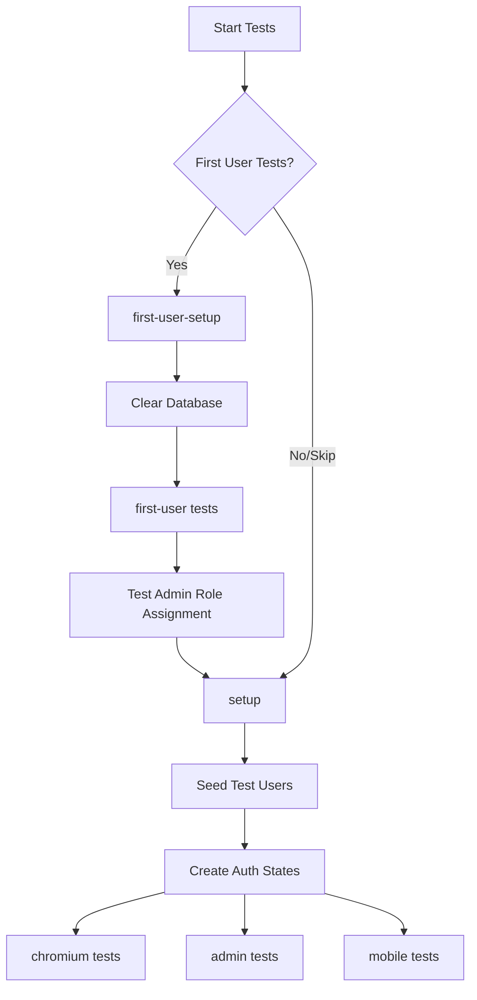

# Playwright Test Strategy with First-User Testing

## Overview
This project uses Playwright's project dependencies to orchestrate complex test scenarios including first-user admin role testing.

## Test Execution Flow



## Available Test Commands

### Run Everything (First-User + Standard Tests)
```bash
pnpm test:e2e:all
# or just
pnpm test:e2e
```
This runs:
1. First-user tests with clean database
2. Seeds test users
3. Runs all standard tests

### Run Only First-User Tests
```bash
pnpm test:e2e:first-user
```
This runs:
1. Clears database
2. Tests first user gets admin role
3. Tests second user gets regular role

### Run Only Standard Tests (Skip First-User)
```bash
pnpm test:e2e:standard
```
This runs:
1. Seeds test users (if needed)
2. Creates auth states
3. Runs chromium + admin tests

### Run with UI
```bash
pnpm test:e2e:ui
```
Opens Playwright UI to run/debug any test configuration

## Project Configuration

### `first-user-setup` Project
- **Purpose**: Clear database for first-user testing
- **File**: `tests/lifecycle/first-user.setup.ts`
- **Runs**: Before first-user tests only

### `first-user` Project
- **Purpose**: Test first user admin role assignment
- **File**: `tests/auth/first-user-admin.spec.ts`
- **Dependencies**: `first-user-setup`
- **Database State**: Empty (0 users)

### `setup` Project
- **Purpose**: Seed users and create auth states
- **File**: `tests/lifecycle/auth-states.setup.ts`
- **Dependencies**: `first-user` (unless SKIP_FIRST_USER_TEST=1)
- **Database State**: Populated with test users

### `chromium` Project
- **Purpose**: Standard browser tests
- **Dependencies**: `setup`
- **Database State**: Seeded with test users

### `admin` Project
- **Purpose**: Admin functionality tests
- **Dependencies**: `setup`
- **Database State**: Seeded with admin user

## Environment Variables

### `SKIP_FIRST_USER_TEST=1`
Skip first-user tests and go straight to standard tests.
Useful for faster testing when not changing auth logic.

```bash
SKIP_FIRST_USER_TEST=1 pnpm test:e2e
```

## How It Works

### 1. Database State Management
The projects handle database state transitions:
- **Clean → First-User Tests → Seeded → Standard Tests**

### 2. Dependency Chain
Playwright ensures tests run in the correct order:
```
first-user-setup → first-user → setup → [chromium, admin, mobile]
```

### 3. Smart Seeding
The `setup` project checks if users exist before seeding:
- If < 3 users: Runs seed script
- If ≥ 3 users: Skips seeding

### 4. Auth State Creation
After seeding, `setup` creates browser auth states for:
- Admin user
- Editor user  
- Regular user

These are saved as JSON files and reused by other tests.

## Troubleshooting

### Tests fail with "User already exists"
The database has leftover data. Run:
```bash
pnpm test:e2e:clean  # Clean all test data
pnpm test:e2e        # Run tests fresh
```

### First-user not getting admin role
1. Check Better Auth hook is enabled in `auth-instance.ts`
2. Verify database is truly empty before test
3. Check logs for "User creation hook" message

### Tests hanging on sign-in
1. Check for translation errors in console
2. Verify no duplicate keys in `messages/en.json`
3. Check for circular dependencies in role definitions

### Want to skip first-user tests
```bash
pnpm test:e2e:standard
# or
SKIP_FIRST_USER_TEST=1 pnpm test:e2e
```

## Best Practices

1. **Don't mix test types**: First-user tests need empty DB, standard tests need seeded DB

2. **Use projects for dependencies**: Let Playwright handle the orchestration

3. **Check logs**: Each setup phase logs its actions for debugging

4. **Clean state for CI**: CI should always run full suite to ensure clean state

## CI Configuration

```yaml
# Example GitHub Actions
- name: Run E2E Tests
  run: |
    # Always run full suite in CI for consistency
    pnpm test:e2e:all
```

This ensures CI always tests:
1. First-user admin assignment
2. All standard functionality
3. Admin features
4. Mobile responsiveness